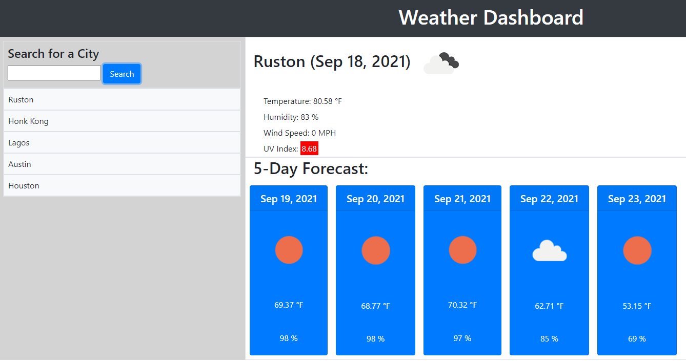

# weather-dashboard

Javascript Challenge

**Version 1.5.0**

**Weather Dashboard App challenge activity.**

The aim of this project is to create a simple calendar application that allows a user to save events for each hour of the day.

This project focuses on the use of javascript to create this application.

Other than creating a user friendly app, this project required the use of certain technologies. Using these technologies also ensured that the user has an enjoyable experience, as well as showcases my skills and knowledge gained through this program.

## About the Project 

As I proceed in my career as a web developer, I will probably be asked to complete a coding assessment. These assessments are typically a combination of challenging and interactive challenges. As a bootcamp student, I want to build a calender app that users can use to create events and ultimately save those event, retrieve them later, and possibly edit previous stored events

Initial design of the app has the following deliverables:

When the user searches for a city then they am presented with current and future conditions for that city and that city is added to the search history.

When the user views current weather conditions for that city they are presented with the city name, the date, an icon representation of weather conditions, the temperature, the humidity, the wind speed, and the UV index.

When the user views the UV index, threy are presented with a color that indicates whether the conditions are favorable, moderate, or severe.

When the user views the future weather conditions for that city, they are  presented with a 5-day forecast that displays the date, an icon representation of weather conditions, the temperature, the wind speed, and the humidity.

Finally, When the user clicks on a city in the search history, they are presented with current and future conditions for that city

## Minimun Requirements

Functional, deployed application.

GitHub repository with README describing project.

Images showing completed portions of the app.

After the game ends, the user can save their initials and score to a highscores view using local storage.

## Built With

- HTML
- CSS
- Javascript
- Bootstraps
- JQuery
- Moment.js
- Open Weather APIs - Current Weather Data, UV Index and 5 day/ 3 Hour Forecast

## Work Completed

**A successful completion of this project includes the following:**

- [x]Pseudo coding
- [x]Use of loops and if, else, esleif, and while statements.
- [x]Application of arrays
- [x]Use of DOM and other methods
- [x]Creating multiple variables and functions
- [x]Applying queryselectors to retrieve information
- [x]Applying bootstraps and jQuery
- [x]Applying local storage to retrieve information

## Project Visual

- [x]Showing the current date at the top of the calender app.

## Github pages and links

This project has been deployed to GitHub Pages. 
- [Deployed application](https://kenesei91.github.io/weather-dashboard/){:target="_blank" "rel="moopener"}

- [Github Repository](https://github.com/kenesei91/weather-dashboard){:target="_blank" "rel="moopener"}

## Contributors

- Kenechukwu K Ilochonwu <keneilo91@yahoo.com>

## Licence & Copyright

© Kenechukwu K Ilochonwu, Web Project Design

Licensed under the [LICENSE] (MIT LICENSE)